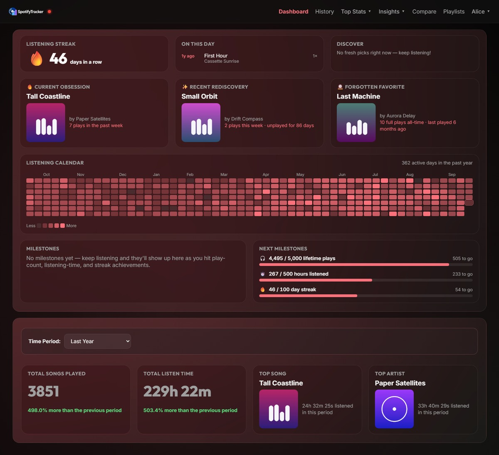
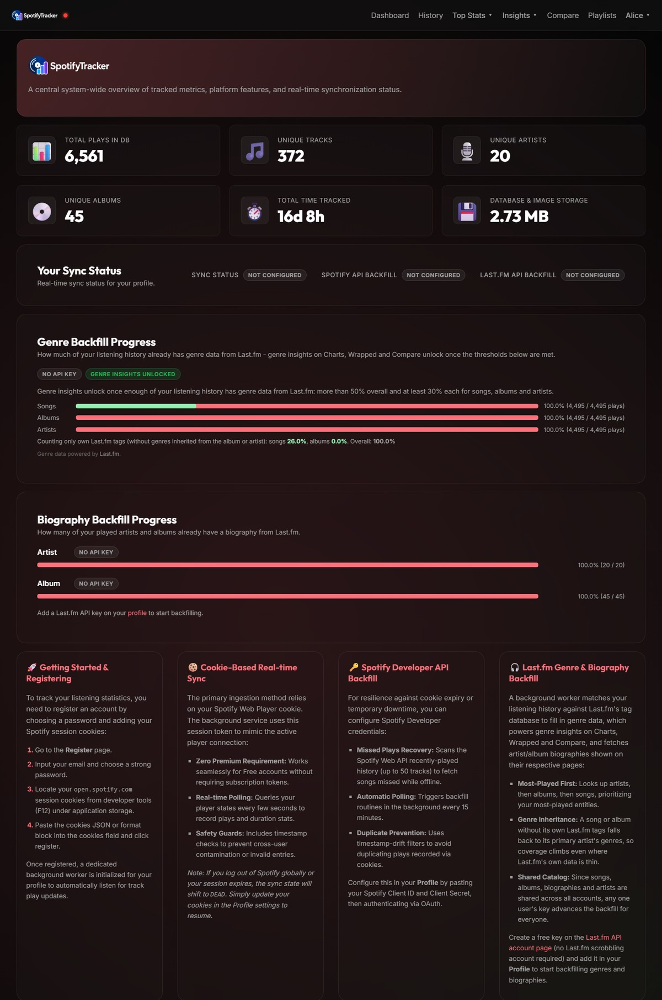
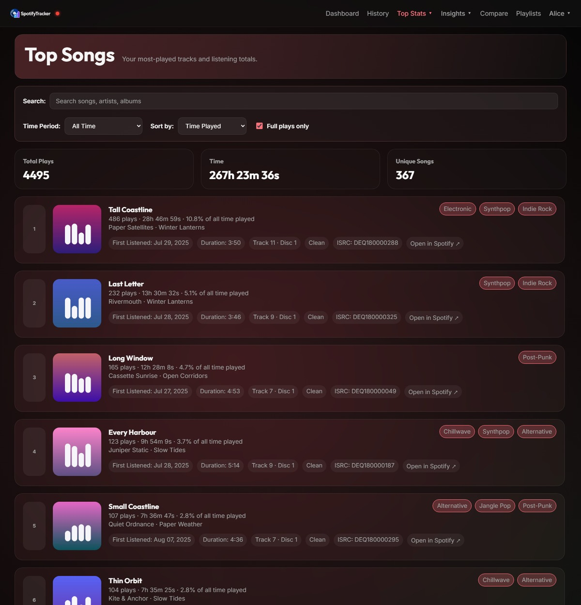
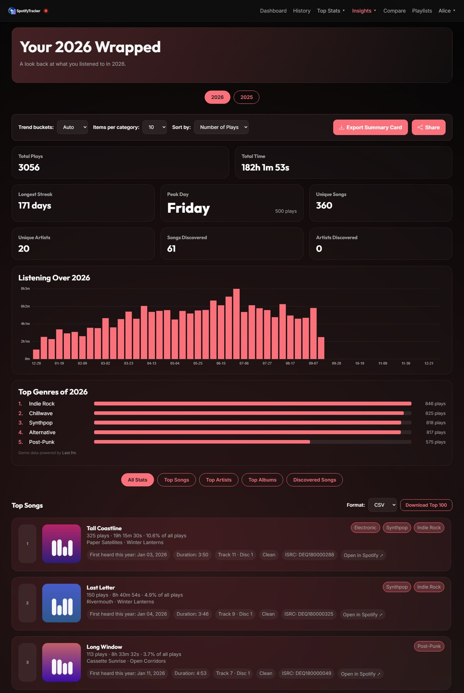
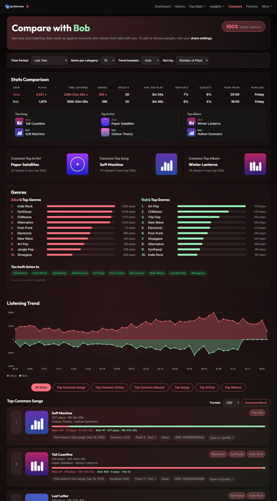
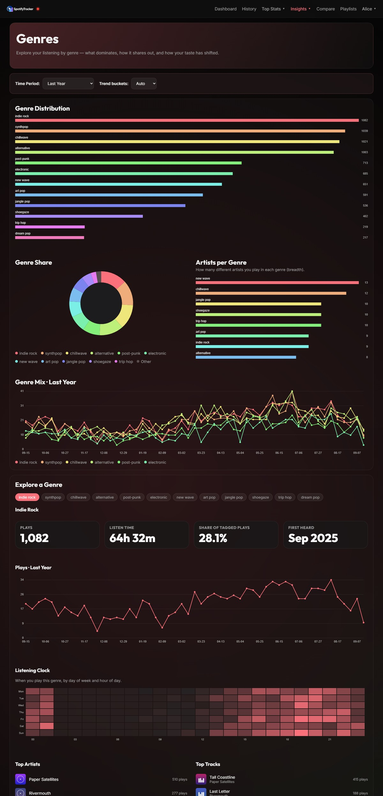
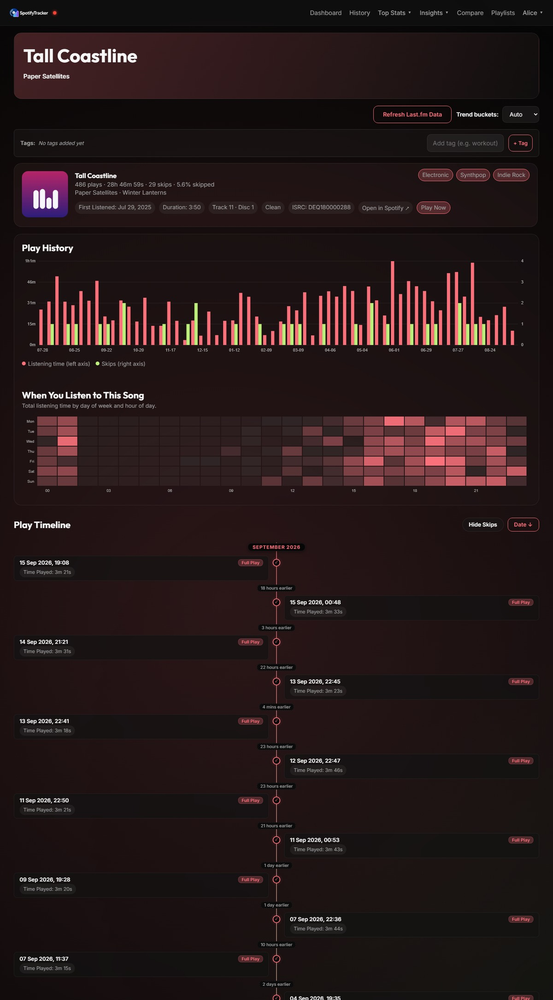
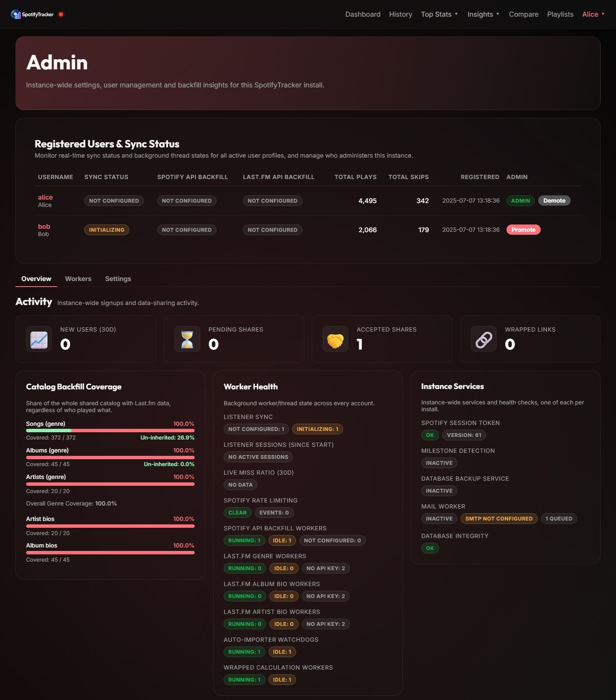

<p align="center">
  <picture>
    <source media="(prefers-color-scheme: dark)" srcset="static/images/brand/wordmark-on-dark.png">
    
  </picture>
</p>

<p align="center">
  Self-hosted Spotify listening history and statistics — <b>no Spotify Premium required</b>.
</p>

<p align="center">
  <a href="https://github.com/i7Gamer/SpotifyStatsTracker/actions/workflows/tests.yml"></a>
  <a href="https://github.com/i7Gamer/SpotifyStatsTracker/actions/workflows/lint.yml"></a>
  <a href="https://github.com/i7Gamer/SpotifyStatsTracker/security/code-scanning"></a>
</p>

If you find it useful, consider giving the [repo](https://github.com/i7Gamer/SpotifyStatsTracker) a ⭐.



<details>
<summary><b>More screenshots</b> — Overview, Top Songs, Wrapped, Compare, Genres, song detail, Admin</summary>









</details>

<sub>Screenshots come from a preview instance seeded with generated data — the artists, albums, songs and cover art are invented.</sub>

## Contents

- [Quick start](#quick-start)
- [Features](#features)
- [Configuration](#configuration)
- [Backups](#backups)
- [Optional integrations](#optional-integrations)
- [Development](#development)
- [Maintenance](#maintenance)
- [License](#license)

## Quick start

The image is published for **linux/amd64 and linux/arm64**, so `docker pull` picks the right one on an x86 server, a Raspberry Pi, an ARM VPS or an Apple Silicon Mac.

```yaml
services:
  spotify-tracker:
    image: i7gamer/spotify-tracker
    ports:
      - "5000:5000"
    volumes:
      - ./Database/Data:/app/Database/Data
      - ./autoImport:/app/autoImport   #< exports dropped here are imported on their own
    environment:
      - FLASK_APP=wsgi.py
      - PYTHONUNBUFFERED=1
      - TZ=America/Los_Angeles
      - FLASK_SECRET_KEY=changeme-generate-your-own-random-value
    restart: always
    stop_grace_period: 45s
```

`docker compose up -d`, then open `http://127.0.0.1:5000`. To update: `docker compose pull && docker compose up -d`.

> **Change `FLASK_SECRET_KEY` before the first start, and never comment it out.** The app refuses to boot on that exact placeholder, because it is public and would make every session forgeable. Generate one with `python -c "import secrets; print(secrets.token_hex(32))"`.
>
> It is also the fallback key for encrypting stored Spotify sessions and API secrets. Leave it unset in Docker and the app writes a key *inside the container*, which `docker compose pull` throws away — so on every update, silently, every user must log in again with fresh cookies and re-enter their API credentials. Changing the value has the same effect. The startup log names it when it happens ("stored secret(s) were encrypted with a DIFFERENT key").

Set `TZ` to **your** IANA zone or every play lands at the wrong local time. [`docker-compose.yml`](docker-compose.yml) in this repo is the same file with every optional variable present and commented out.

> **Run one instance.** The app is a single process (Waitress/Flask), and the per-IP rate limiter, login-status cache and worker pools live in that process. Scaling it horizontally behind a load balancer does not work.

## Features

- **Top Lists** — top songs, artists and albums, with tag and "full plays only" filters and a badge showing each entry's rank movement since the previous equal-length period.
- **Listening History** — a `/history` page with instant AJAX filtering, plus a contribution-style streak calendar on the dashboard.
- **Trend Insights** — dashboard cards for your current Obsession, a Rediscovery (or Fresh Find), and a Forgotten Favorite.
- **Charts & Analytics** — interactive charts at hour/day/week/month/year granularity, a Top Genres breakdown, and a Listening Behavior card (shuffle, offline, Incognito, how plays ended, platforms) built from extended streaming history.
- **Yearly Wrapped** — a per-year recap with category filters and top genres, shareable via links with custom expiration.
- **Data Sharing & Comparison** — mutually accepted sharing, then a side-by-side Compare page with a taste-match score and shared genres; your dashboard also shows what those people are playing right now.
- **Achievement Milestones** — lifetime play-count and listening-time thresholds, streaks and each new all-time #1 artist, surfaced as a topbar badge, dashboard cards and optional email.
- **Personal Tagging & Playlist Export** — free-text tags on any song, artist or album, exportable as CSV, M3U or XSPF from `/playlists`.
- **Detail Pages** — per-song/artist/album stats, biographies, an embedded Spotify player and an interactive play-history timeline with date headers, time gaps and skip filters.
- **Genre Insights & Biographies** — a free Last.fm key backfills genre tags and artist/album biographies in the background (see [Genre data](#genre-data-lastfm)).
- **Import & Export** — import several Spotify data-export files at once with progress tracking, drop files into `autoImport/` for hands-off importing, or export your own history as JSON or CSV.
- **Overview Page** — database-wide totals, your listening breakdown, API backfill configuration and genre-backfill progress.
- **Admin Console** — worker health, user sync states, catalog backfill coverage and instance-wide settings at `/admin`, plus warnings for a deploy that was copied but never restarted and for push listening without a working API backfill.
- **Sign Out Everywhere** — end every other browser session at once from Profile > Account, staying signed in where you pressed it. A password reset does the same automatically.

## Configuration

Every variable below is optional unless marked otherwise, and every one is present (commented out) in [`docker-compose.yml`](docker-compose.yml).

| Variable | Default | What it does |
| --- | --- | --- |
| `FLASK_SECRET_KEY` | **required** | Signs sessions and, unless `DATA_ENCRYPTION_KEY` is set, encrypts stored Spotify sessions and API secrets. See the warning above. |
| `TZ` | UTC | Your IANA zone. Wrong zone, wrong local time on every play. |
| `DATA_ENCRYPTION_KEY` | falls back to `FLASK_SECRET_KEY` | Dedicated at-rest key for stored sessions and API secrets. If you uncomment it, change it — the app refuses to start on `DATA_ENCRYPTION_KEY=changeme-another-random-value`. Keep it with your backups: without it, stored credentials cannot be read. |
| `ADMIN_EMAIL` | earliest-registered user | Makes this account the instance's only admin (`/admin`). |
| `SPOTIFY_CALLBACK_URL` | unset | Your public callback URL. Enables [Spotify Web API backfilling](#spotify-web-api-backfilling). |
| `TRUST_PROXY_HEADERS` | `0` | Number of proxy hops, so rate limiting sees real client IPs. Only set this when a proxy really is in front — otherwise clients can forge their IP. |
| `ENABLE_HSTS` | `0` | Sends `Strict-Transport-Security`. Only behind TLS termination; on plain HTTP it locks browsers out. |
| `IMPORT_KEYWORD` | unset | Auto-import only files whose name contains this keyword. |
| `WAITRESS_THREADS` | `16` | Request-handling threads. Worth raising only if pages queue up with many people browsing at once. |
| `SKIP_EMAIL_VERIFICATION` | `0` | Disables the "do these cookies belong to this email" check. It is what stops one user claiming another's account and what stops `/reset-password` setting a password on any account — only for an instance where you trust everyone who can reach it. |
| `SMTP_SKIP_TLS_VERIFY` | `0` | For a self-hosted relay with a self-signed certificate only; notification mail then skips certificate and hostname verification. |
| `ALLOW_INSTANCE_RESTART` | `0` | Shows the admin console's **"Restart app to apply"** button. See [Restarting the app](#restarting-the-app). |
| `BACKUP_INTERVAL_HOURS` | `24` | How often to snapshot the database; `0` disables automatic backups. |
| `BACKUP_RETENTION_COUNT` | `7` | How many snapshots to keep; `0` disables automatic backups. |
| `BACKUP_DIR` | `Backups/` beside the database | Where snapshots go. Point it at another disk or an off-machine mount — see [Backup and recovery](docs/backup-and-recovery.md). |
| `FLASK_DEBUG` | `0` | Verbose Flask logging. Enable when reporting an issue. |
| `SPOTIFY_TOTP_SECRET` | pinned in-app | Emergency override if Spotify rotates its TOTP secret and logins fail instance-wide before a fixed release is out; the log says so when that happens. Format `"<version>:<comma-separated bytes>"`. |
| `SPOTIFY_TOTP_AUTO_RECOVER` | `1` | After 3 consecutive session-token failures, adopts the current secret from Spotify's own web player, retrying at most every 15 minutes. Set to `0` to keep anything from touching authentication on its own. |

### Upgrading from an older version

**Restart the app after updating the files.** Copying a new version over a running instance is not a deploy: `static/` is read from disk per request, while templates and Python are held in memory from startup — so the browser gets the new scripts and the server keeps serving the old markup. `docker compose pull && docker compose up -d` handles this; a manual file copy does not. `/admin` shows a banner whenever the running process and the files on disk disagree.

Everything persistent lives in the mounted `Database/Data/`. If you were relying on `secrets/` being mounted so `secrets/flask_secret_key.txt` survived restarts, set `FLASK_SECRET_KEY` instead.

### Restarting the app

The admin console's **"Restart app to apply"** button (hidden unless `ALLOW_INSTANCE_RESTART=1`) applies worker-pool sizes from the Advanced Tuning panel. It stops background workers gracefully and exits, so **something must relaunch the process**:

- **Docker** already does (`restart: always`), so it is safe to enable there.
- **Running `python wsgi.py` directly**, wrap it in a supervisor first (NSSM, a Task Scheduler task, or `while ($true) { python wsgi.py }`) — otherwise the button just stops the app with nothing to bring it back.

## Backups

Listening history, tracks, images and login sessions all live in one SQLite file at `Database/Data/spotify_stats.db`. The cover and artist images sit beside it in `Database/Data/Media/` and belong in the same backup — a database restored without them still works, but every image is re-downloaded on demand.

**Automatic backups are on by default**: a snapshot every 24 hours into `Database/Data/Backups/`, newest 7 kept. Tune them with `BACKUP_INTERVAL_HOURS`, `BACKUP_RETENTION_COUNT` and `BACKUP_DIR` above. `BACKUP_RETENTION_COUNT=0` also skips the safety snapshot taken before a version upgrade migrates the database, so take a manual one from `/admin` first if you rely on it.

By default those snapshots share a disk with the database: they protect against corruption and accidental deletion, not against losing the disk.

> **[Backup and recovery](docs/backup-and-recovery.md)** covers the rest — getting snapshots off the machine, the encryption key they are useless without, taking a snapshot by hand from a live WAL-mode database, and a verification drill to run before you need it.

## Optional integrations

### Spotify Web API backfilling

Backfills plays the live listener missed. Requires `SPOTIFY_CALLBACK_URL`:

1. Register an application in the [Spotify Developer Dashboard](https://developer.spotify.com/dashboard).
2. Set its **Redirect URI** to your public callback URL (e.g. `http://localhost:5000/spotify-callback`).
3. Set `SPOTIFY_CALLBACK_URL` to that exact URL.
4. Link your account under Profile > Connections, which appears once the variable is set.

Fallback `Unknown track` metadata is repaired when a later history response or catalog backfill supplies the real track — history repair reuses the response already fetched, and catalog repair stays inside the existing cadence, cooldown and batch budget. Historical play and skip fields are preserved; to reclassify old skips after durations are repaired, save the admin skip settings to run the bulk reclassification.

### Genre data (Last.fm)

Each user adds their own [Last.fm](https://www.last.fm) API key to have a background worker fetch genre tags:

1. Create a free key on the [Last.fm API account page](https://www.last.fm/api/account/create) (no scrobbling account required).
2. Paste it into Profile > Connections.
3. The worker starts with your most-played artists, albums and songs, respecting Last.fm's rate limits. Once your library is covered it keeps backfilling everyone else's, since the catalog is shared.
4. Track progress on the Overview page. Genre breakdowns unlock on Charts, Wrapped and Compare once enough of your history has data.

Songs and albums Last.fm has no tags for inherit their artist's genres; the admin console toggles whether those inherited genres count towards progress and stats.

## Development

Run the app directly on port 5444 (`http://localhost:5444`):

```bash
git clone https://github.com/i7Gamer/SpotifyStatsTracker
cd SpotifyStatsTracker
pip install -r requirements.txt
python app.py
```

Data persists in `Database/Data/` either way.

### Running the tests

`pytest-xdist` is required rather than optional: `pyproject.toml` sets `addopts = "-n auto"`, so without it pytest refuses to start instead of running serially.

```bash
pip install -r requirements.txt -r requirements-dev.txt
pytest
```

Use `pytest -n 0` to run serially when a failure reads better that way, or to keep `print`/`-s` output in order — `-p no:xdist` does *not* work, it makes `-n` an unrecognized argument. Linting matches CI: `ruff check .` for Python, `npm run lint` for `static/js` (after `npm install`).

## Maintenance

- [Backup and recovery](docs/backup-and-recovery.md) — off-host snapshots, encryption keys, manual snapshots, restore verification.
- [Recover a legacy account](docs/recover-a-legacy-account.md) — associating an email with a pre-email `users` row, with the guarded SQL to do it.

## License

**GNU Affero General Public License v3.0 or later** — see [COPYING](COPYING). You may use, study, modify and redistribute it, but derivative works stay under the AGPL, and **running a modified version as a network service obliges you to offer its source to that service's users** (AGPL-3.0 section 13).

The project was MIT-licensed through 1.45.0, and anything obtained at or before that point stays MIT. The move to copyleft was required rather than preferred: `spotapi`, a runtime dependency the Docker image bundles, is GPL-3.0. See [NOTICE](NOTICE) for the relicensing history and third-party components.

## Support

Questions and bug reports are welcome as GitHub issues on this repository.
